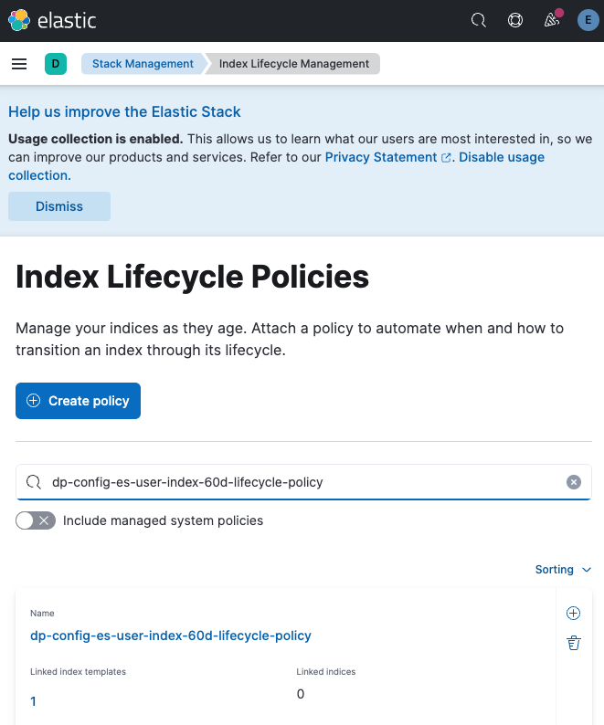
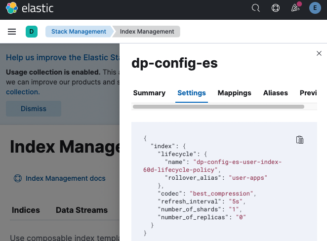

# tp-config
This is temporary repository to configure your "bring your own" BYO elastic search instance.

All config files for ElasticSearch should be submitted under [elastic](https://github.com/efloresb-tibco/tp-config/raw/main/elastic) folder.

## Create Index Lifecycle Policy
This will allow us to keep only 60 days of logs.

1. Star by exporting this env vars
```bash
export TP_CONFIG_ELASTIC_HOST=${TP_CONFIG_ELASTIC_HOST:-"localhost"};
export TP_CONFIG_ELASTIC_PORT=${TP_CONFIG_ELASTIC_PORT:-"9200"};
export TP_CONFIG_ELASTIC_USERNAME=${TP_CONFIG_ELASTIC_USERNAME:-"elastic"};
export TP_CONFIG_ELASTIC_PASSWORD=${TP_CONFIG_ELASTIC_PASSWORD:-"XXXXX"};
```

2. Get the Index Lifecycle Policy by running this command.
```bash
curl -LJO 'https://github.com/efloresb-tibco/tp-config/raw/main/elastic/index-tp-lifecycle.json' -o index-tp-lifecycle.json
```

3. Create the Index Lifecycle Policy via API call.
```bash
curl --location --request PUT "https://$TP_CONFIG_ELASTIC_HOST:$TP_CONFIG_ELASTIC_PORT/_ilm/policy/dp-config-es-user-index-60d-lifecycle-policy" -u "$TP_CONFIG_ELASTIC_USERNAME:$TP_CONFIG_ELASTIC_PASSWORD" -H 'Content-Type: application/json' --data "@index-tp-lifecycle.json"
```

4. Valitade that the Index Lifecycle Policy has been created.
```bash
curl --location --request GET "https://$TP_CONFIG_ELASTIC_HOST:$TP_CONFIG_ELASTIC_PORT/_ilm/policy/dp-config-es-user-index-60d-lifecycle-policy" -u "$TP_CONFIG_ELASTIC_USERNAME:$TP_CONFIG_ELASTIC_PASSWORD" | jq
```
<p align="center">
  
</p>

5. Clean up.
```bash
curl --location --request DELETE "https://$TP_CONFIG_ELASTIC_HOST:$TP_CONFIG_ELASTIC_PORT/_ilm/policy/dp-config-es-user-index-60d-lifecycle-policy" -u "$TP_CONFIG_ELASTIC_USERNAME:$TP_CONFIG_ELASTIC_PASSWORD"
```

## Create Index Template
This will allow us to create our index template(s).

1. Star by exporting this env vars
```bash
export TP_CONFIG_ELASTIC_HOST=${TP_CONFIG_ELASTIC_HOST:-"localhost"};
export TP_CONFIG_ELASTIC_PORT=${TP_CONFIG_ELASTIC_PORT:-"9200"};
export TP_CONFIG_ELASTIC_USERNAME=${TP_CONFIG_ELASTIC_USERNAME:-"elastic"};
export TP_CONFIG_ELASTIC_PASSWORD=${TP_CONFIG_ELASTIC_PASSWORD:-"XXXXX"};
```

2. Get the Index Template by running this command.
```bash
curl -LJO 'https://github.com/efloresb-tibco/tp-config/raw/main/elastic/index-tp-bwce-apps.json' -o index-tp-bwce-apps.json
```

3. Create the Index Template via API call.
```bash
curl --location --request PUT "https://$TP_CONFIG_ELASTIC_HOST:$TP_CONFIG_ELASTIC_PORT/_index_template/dp-config-es" -u "$TP_CONFIG_ELASTIC_USERNAME:$TP_CONFIG_ELASTIC_PASSWORD" -H 'Content-Type: application/json' --data "@index-tp-bwce-apps.json"
```

4. Valitade that the Index Template has been created.
```bash
curl --location --request GET "https://$TP_CONFIG_ELASTIC_HOST:$TP_CONFIG_ELASTIC_PORT/_index_template/dp-config-es" -u "$TP_CONFIG_ELASTIC_USERNAME:$TP_CONFIG_ELASTIC_PASSWORD" | jq
```
<p align="center">
  
</p>

5. Clean up.
```bash
curl --location --request DELETE "https://$TP_CONFIG_ELASTIC_HOST:$TP_CONFIG_ELASTIC_PORT/_index_template/dp-config-es" -u "$TP_CONFIG_ELASTIC_USERNAME:$TP_CONFIG_ELASTIC_PASSWORD"
